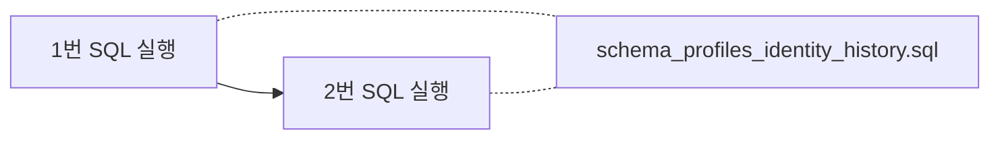

# Supabase — “지우고 다시 깔기” 순서 (쉬운 말)

## 언제 이렇게 하나요?

예전에 제미나이 등으로 **SQL이 꼬였을 때**, 우리 프로젝트에 있는 설계도만 **다시 맞추고 싶을 때**입니다.

---

## 순서 (2번만 기억하면 됨)



| 순서 | 파일 | 하는 일 |
|------|------|-----------|
| **1** | `supabase/drop_profiles_identity_schema.sql` | 표·트리거·함수 **지우기** (한 번에 정리) |
| **2** | `supabase/schema_profiles_identity_history.sql` | **새로** 표·트리거·함수·정책 **만들기** |

각 파일을 **통째로 복사** → Supabase **SQL Editor** → **Run** 한 번씩이면 됩니다.

---

## 주의

- **1번**을 하면 `profiles` / `identity_history` **안에 있던 글·명함 데이터는 전부 사라집니다.**
- **로그인 계정(`auth.users`)** 은 1번만으로는 안 지워집니다.  
  계정까지 없애려면 대시보드 **Authentication → Users** 에서 직접 지우세요.
- **2번만** 새로 돌렸다면: `migration_home_country_iso.sql` 은 **안 돌려도 됩니다.**  
  (메인 스키마에 이미 ISO 나라 코드 규칙이 들어 있습니다.)  
  **예전에 KR/JP/US만 있던 오래된 DB**를 고칠 때만 마이그레이션 파일을 씁니다.

---

## 끝난 뒤 확인

1. **Table Editor**에 `profiles`, `identity_history`가 보이는지  
2. **Authentication**에서 테스트 가입 한 번 → `profiles`에 **한 줄** 생기는지

---

## alignment 운영 저장 (추가 — 2026-07-28)

> `migration_alignment_system.sql`은 **아직 자동 적용되지 않습니다.** 테스트 프로젝트에서 검토 후 적용하세요.

### 권장 적용 순서

| 순서 | 작업 |
|------|------|
| 1 | 기존 Supabase 스키마 백업 |
| 2 | `supabase/migration_alignment_system.sql` 검토 |
| 3 | 테스트 프로젝트에 migration 적용 |
| 4 | RLS 확인 (authenticated 자신 SELECT만 · 쓰기 정책 없음) |
| 5 | `.env`에 `SUPABASE_SERVICE_ROLE_KEY` 설정 (**브라우저 노출 금지**) |
| 6 | 서버 repository `healthCheck()` |
| 7 | `runAlignmentBatch({ dryRun: true })` |
| 8 | 테스트 batch 실제 저장 |
| 9 | 중복 batchId 재실행 → skipped 확인 |
| 10 | 운영 적용 |
| 11 | 05:00 / 17:00 스케줄 등록 (별도 작업) |

### 환경변수

- `SUPABASE_URL` — 기존과 동일
- `SUPABASE_SERVICE_ROLE_KEY` — **서버 전용** · alignment 배치 RPC 호출에만 사용 · **브라우저 노출 금지**

### 게시판 코어 (추가 — 2026-07-29)

> `migration_board_core_system.sql`도 **자동 적용하지 않습니다.**

권장 순서: profiles/identity → alignment → **board core**

| 파일 | 내용 |
|------|------|
| `migration_board_core_system.sql` | posts/comments/reactions/reports · RLS · `toggle_board_reaction` |

환경변수:

- `BOARD_OPERATIONAL=true` — migration + 영토 adapter 준비 후에만
- `BOARD_DEV_MEMORY=true` — 개발용 메모리 API (실데이터 아님)

### Live 검증 (alignment 테스트 프로젝트만)

```bash
# 1) project ref 확인 (SUPABASE_URL 호스트의 서브도메인)
# 2) 테스트 전용 auth 사용자 UUID 준비
# 3) 쓰기 검증 실행
ALIGNMENT_LIVE_VERIFY=true ^
ALIGNMENT_VERIFY_PROJECT_REF=<test-project-ref> ^
ALIGNMENT_VERIFY_TEST_USER_ID=<test-user-uuid> ^
ALIGNMENT_VERIFY_CLEANUP=true ^
npm run test:alignment-supabase-live
```

- `ALIGNMENT_LIVE_VERIFY=true` 가 아니면 쓰기 검증을 **실행하지 않음**
- `ALIGNMENT_VERIFY_PROJECT_REF` 가 설정되면 URL의 project ref와 **일치할 때만** 실행
- 테스트 batchId만 사용: `alignment-TEST-YYYYMMDD-HHmmss-<random>`
- service-role key 값은 로그에 출력하지 않음
- 운영 프로젝트로 의심되면 즉시 중단

### 생성되는 객체 (alignment)

- `public.user_alignment_state` (score/signal: `numeric(20,6)`)
- `public.alignment_batches`
- `public.alignment_history`
- `public.persist_alignment_batch_plan(jsonb)` RPC
  - batch INSERT `ON CONFLICT DO NOTHING` → 동시 중복 skipped
  - history unique 오류는 batch 중복으로 오인하지 않고 rollback

### 생성되는 객체 (board)

- `public.board_posts` / `board_comments` / `board_reactions` / `board_reports`
- `public.board_posts_public` / `board_comments_public` (익명 ID 마스킹 View)
- `public.toggle_board_reaction(...)` RPC

alignment dataSource 조회 예시 (EARTH만):

```sql
SELECT id, actor_user_id, target_author_user_id, reaction_type,
       actor_territory_at_reaction, target_author_territory_at_reaction,
       created_at, cancelled_at, audience_scope, target_type,
       COALESCE(post_id, comment_id) AS target_id
FROM public.board_reactions
WHERE audience_scope = 'EARTH';
```